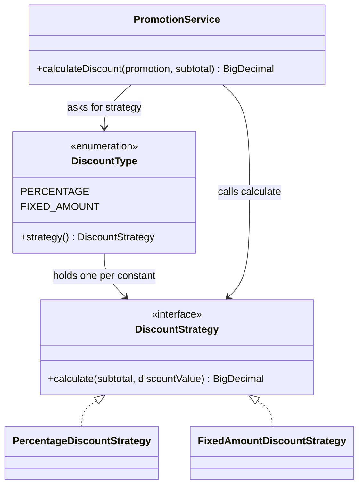

# Design Pattern: Strategy for Promotion Discounts

LaundryLink uses the Strategy pattern (behavioural, Lecture 10) to calculate promotion discounts. Each discount type has its own calculation class, and `PromotionService` uses whichever one the promotion's discount type supplies, with no `if/else` on the type.

All classes are in `src/main/java/_6/Y2/S1/MTR/_6/LaundryLink/promotion/`.

## Problem

`PromotionService.calculateDiscount` used to choose the calculation with an `if/else` on the discount type:

```java
BigDecimal discountAmount;
if (promotion.getDiscountType() == DiscountType.PERCENTAGE) {
    discountAmount = subtotal
            .multiply(promotion.getDiscountValue())
            .divide(BigDecimal.valueOf(100), 2, RoundingMode.HALF_UP);
} else {
    discountAmount = promotion.getDiscountValue();
}
```

Every new discount type would have meant editing this method and adding another branch.

## Solution

| Pattern role | Lecture example | LaundryLink class |
| --- | --- | --- |
| Strategy interface | `PaymentStrategy` | `DiscountStrategy` |
| Concrete strategy | `CreditCardPayment` | `PercentageDiscountStrategy` |
| Concrete strategy | `PayPalPayment` | `FixedAmountDiscountStrategy` |
| Context | `ShoppingCart` | `PromotionService` (`calculateDiscount`) |
| Client (picks the strategy) | Code that calls `setPaymentStrategy` | `DiscountType` enum |



## How it works

1. A promotion is loaded from the database with its `DiscountType` (`PERCENTAGE` or `FIXED_AMOUNT`).
2. Each `DiscountType` constant holds its own strategy object and returns it from `strategy()`.
3. `PromotionService.calculateDiscount` checks the inputs, asks the type for its strategy, and calls `calculate`.
4. `PromotionService` then caps the result so the discount never exceeds the subtotal.

```java
DiscountStrategy strategy = promotion.getDiscountType().strategy();
BigDecimal discountAmount = strategy.calculate(subtotal, promotion.getDiscountValue());
```

The input checks and the cap apply to every discount type, so they stay in `PromotionService`. Only the part that differs between types lives in the strategies.

The strategy sits on the enum rather than being injected as a Spring bean, so the `PromotionService` constructors and the Spring wiring are unchanged.

## Adding a new discount type

1. Create a class that implements `DiscountStrategy`.
2. Add a constant to `DiscountType` that passes the new strategy to the constructor.
3. Add the new value to the `CHECK` constraint on `promotions.discountType` in the database.

`calculateDiscount` does not need to change (Open/Closed Principle).

## Behaviour

The refactor does not change any discount amount, API response, database column or front-end code.

| Rule | Example | Discount |
| --- | --- | --- |
| Percentage is a share of the subtotal | 10% on 1000.00 | 100.00 |
| Percentage rounds to 2 decimals, half up | 15% on 333.33 | 50.00 |
| Fixed amount ignores the subtotal | 200 off on 1000.00 | 200 |
| Discount never exceeds the subtotal | 500 off on 300.00 | 300.00 |
| Null or negative subtotal is rejected | subtotal of -1 | `IllegalArgumentException` |

## Tests

- `PromotionServiceTest` (17 tests) covers the discount rules through `validatePromotion` and `applyPromotion`. It was not edited for this change.
- `DiscountStrategyTest` (4 tests) checks each strategy directly and that each `DiscountType` supplies the right one.

Run both from the project root in PowerShell:

```powershell
.\mvnw.cmd test "-Dtest=PromotionServiceTest,DiscountStrategyTest"
```

Both passed (21 of 21) on 8 October 2026.

## Consequences

- **Benefit:** a new discount type is one new class plus one enum constant, with no edit to `calculateDiscount`.
- **Cost:** three extra files for two algorithms.
- **Not covered:** the "percentage cannot exceed 100" rule in `validatePromotionDefinition` still branches on the type. It is a validation rule that the database also enforces, so it was left as it is.
